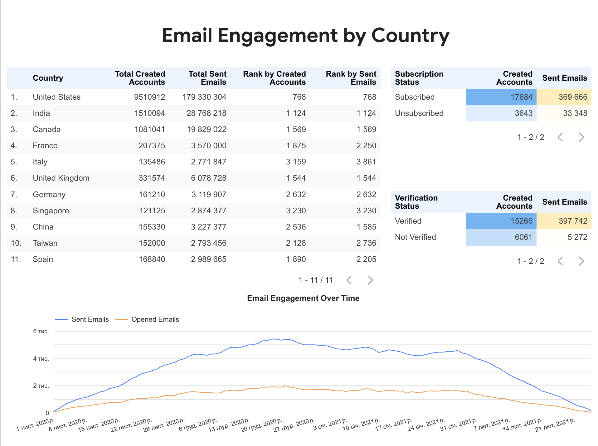

# Email Engagement by Country (BigQuery SQL)

This project builds a dataset for analyzing account creation and email engagement by country.

## Metrics
- created_accounts
- sent_emails
- opened_emails
- visited_emails

## Dimensions
- date
- country
- send_interval
- verification_status
- subscription_status

## Output
The final dataset includes country-level metrics, country ranks, subscription status breakdown, verification status breakdown, and email engagement trends over time.

It keeps only the top countries by total created accounts or total sent emails.

## Files
- `query.sql` — BigQuery SQL query
- `dashboard.png` — Looker Studio dashboard screenshot

## Dashboard preview

